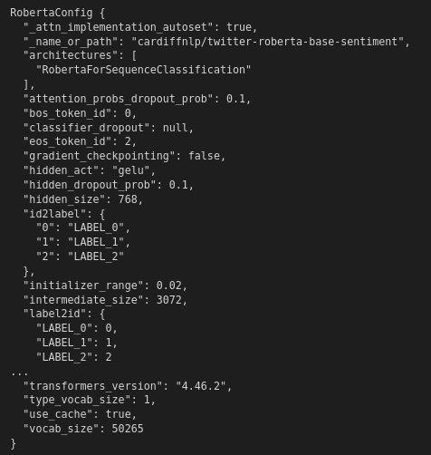
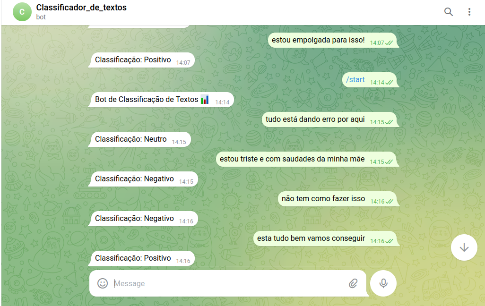
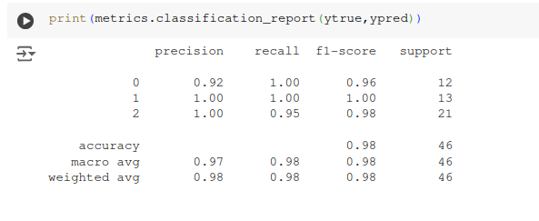

# Classificação-de-textos
## Projeto desenvolvido por:
- [Júlia Campos](https://github.com/juliacamposn)

## Descrição
- Este é um projeto que foi proposto dentro da disciplina de Inteligência Artificial, e tem como objetivo classificação textos usando de qualquer arquitetura para classificação de textos disponível no site [Hugging face](https://huggingface.co/models?pipeline_tag=text-classification&sort=trending). O projeto se divide em alguns desafios como: escolher duas arquiteturas distintas de classificação de texto; desenvolver soluções com ambas; selecionar uma das soluções para ser implantada no Telegram.
- As duas arquiteturas que eu escolhi foram [SamLowe/roberta-base-go_emotions](https://huggingface.co/SamLowe/roberta-base-go_emotions) que classifica sentimentos em positivo, negativo e neutro, e [facebook/fasttext-language-identification](https://huggingface.co/facebook/fasttext-language-identification) que entre outras coisas, faz classificação de texto para qual idioma está o texto, calcula a similaridade das palavras em diferentes idiomas, isso tudo graças ao modelo ter sido treinado em 157 idiomas diferentes.

## Desenvolvimento
- O projeto foi desenvolvido usando o Google Colab.
- Como eram arquiteturas bem distintas foram dois arquivos .pynb um para cada modelo. No arquivo trabalho_2_classifcação-de-texto.ipynb encontra-se o modelo 1 roberta-base-go_emotions, e no arquivo m2-t2-ia.ipynb encontra-se o modelo 2 fasttext-language-identification.
- O modelo que o foi escolhido para fazer deploy no telegram foi trabalho_2_classifcação-de-texto.ipynb(roberta-base-go_emotions) que faz classificação de emoções entre positivo, negativo e neutro.
- Abaixo estão algumas configurações do modelo roberta-base-go_emotions que foram importantes para o desenvolvimento do código, as labels 0,1,2 que refletem as labels do dataset, a inicialização dos pesos com 0.02, o tamanho do vocabulário usado pelo modelo que é de 50.265 e a versão da biblioteca transformers.

### Construção do dataset
- O dataset deveria ser construido pelo próprio desenvolvedor do projeto, e é claro, com base na arquitetura escolhida. No meu caso foram duas base de dados diferentes, um para cada modelo, estão ambas disponíveis nos arquivos .csv deste projeto. Em algumas instruções para desenvolver o projeto foi recomendado no mínimo 100 exemplos de cada classe no dataset

## Resultados
- Abaixo está o chatbot de classificação de sentimentos feito com o modelo roberta-base-go_emotions, e os resultados obtidos.

- Como resultado deste projeto, concluí que a classificação de sentimentos é uma tarefa desafiadora, até mesmo para nós, humanos. Durante o treinamento do modelo, percebi que ele realiza a classificação principalmente com base nos padrões apresentados no conjunto de dados utilizado. Por exemplo, para mim, Julia, a frase 'estou com fome' seria classificada como um sentimento negativo. Isso porque, de acordo com minha experiência de vida, sentir fome está associado a uma sensação desagradável, e portanto, negativa. No entanto, o modelo a classificou como neutra, evidenciando que sua interpretação depende diretamente dos dados fornecidos durante o treinamento.